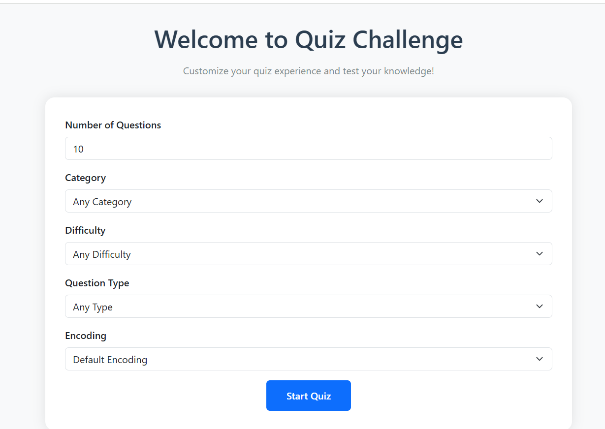
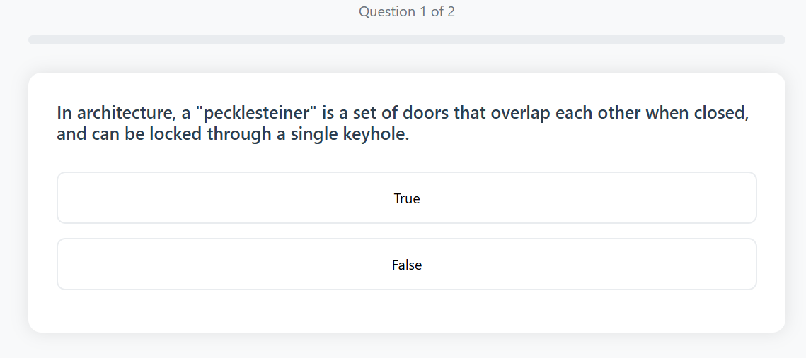
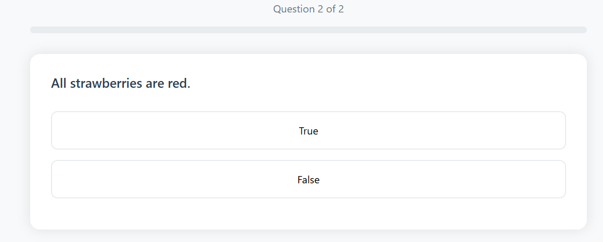

# 🧠 Django Quiz Application (OpenTDB API Based)

A dynamic and customizable quiz application built with Django that fetches questions from the Open Trivia Database (OpenTDB) API. Supports multiple question types (MCQ, True/False) with options to select number of questions, category, and difficulty level.

## ✨ Features

- 🔄 Fetches live quiz questions from the OpenTDB API
- ✅ Supports:
  - Multiple Choice Questions (MCQ)
  - True/False questions
- ⚙️ User-defined settings:
  - Number of questions
  - Quiz category (e.g. Science, History, etc.)
  - Difficulty level (easy, medium, hard)
  - Question type (MCQ or True/False)
- 🎯 Real-time score calculation
- 💾 Stores quiz results for review

---

## 🛠️ Technologies Used

- **Backend:** Django (Python)
- **Frontend:** HTML5, CSS3, Bootstrap (or any templating)
- **API:** [OpenTDB](https://opentdb.com/)

---

## 🚀 Getting Started

### 📦 Installation

1. **Clone the repository**
   ```bash
   git clone https://github.com/sukantahirock/Quiz-Application.git
   cd Quiz-Application
   ```

2. **Create a virtual environment and activate it**

   ```bash
   python -m venv venv
   source venv/bin/activate     # For Linux/macOS
   venv\Scripts\activate        # For Windows
   ```

3. **Install dependencies**

   ```bash
   pip install -r requirements.txt
   ```

4. **Run migrations**

   ```bash
   python manage.py migrate
   ```

5. **Start the development server**

   ```bash
   python manage.py runserver
   ```

6. **Visit in your browser**

   ```
   http://127.0.0.1:8000/
   ```

---

## 📷 Screenshots

| Quiz Settings                         | Quiz in Progress              | Time                                || Results                             |
| ------------------------------------- | ----------------------------- | ----------------------------------- || ----------------------------------- |
|  |  |  |   |


---

## 🧩 API Information

This application uses the [OpenTDB API](https://opentdb.com/) to dynamically fetch quiz questions.

**Sample API URL:**

```
https://opentdb.com/api.php?amount=10
```

You can modify:

* `amount`: Number of questions
* `category`: Category ID
* `difficulty`: easy | medium | hard
* `type`: multiple | boolean

---

## 🤝 Contributing

Pull requests are welcome. For major changes, please open an issue first to discuss what you would like to change.

---

## 📄 License

This project is licensed under the MIT License.

---

## 👨‍💻 Author

**Sukanta**
[GitHub Profile](https://github.com/sukantahirock)

---

```
